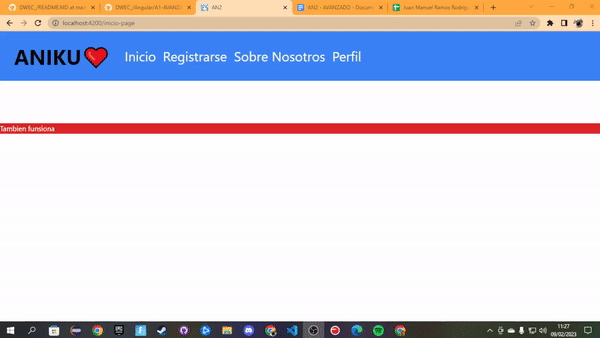
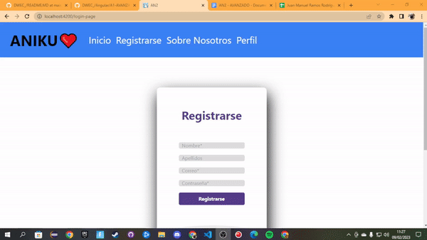
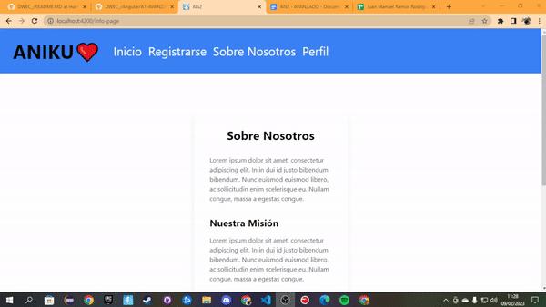
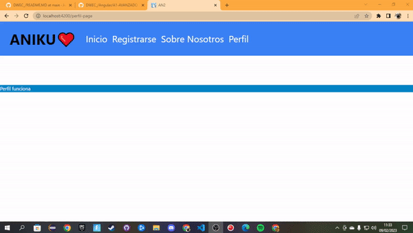
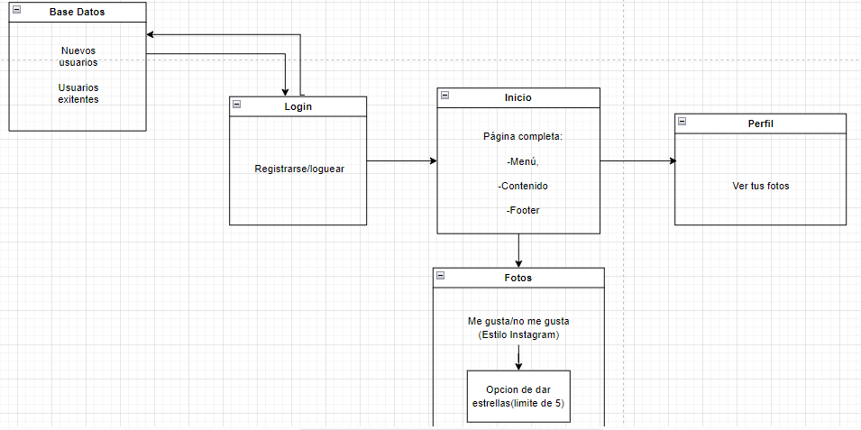
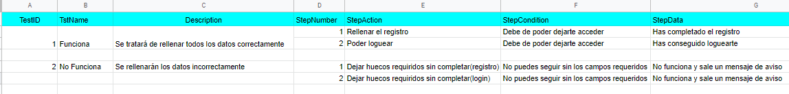

## ANGULAR

> Tarea AVANZADA.

## 🔍 Análisis del problema
Se debe indicar en el directorio específico de la asignatura el problema que se va a resolver de una forma adecuada, es decir, no debe contener ambigüedades, debe ser simple y autocontenido. A continuación veremos lo que será un paginado en el que puedes ir moviéndote entre las páginas y que consta de 5 realaciones entre estas.

## 💠Diseño (uml)

Aquí estaría el diseño UML de este formulario

## 🔻Implementación 
Ya está todo el ejercicio implementado como vemos tanto en el apartado de diseño como en el de prueba.

## 🔁Prueba

Aquí tendríamos la 1ª prueba, que sería dirigirse a la página "Inicio"   

Aquí tendríamos la 2ª prueba, que sería dirigirse a la página "Registrarse"   

Aquí tendríamos la 3ª prueba, que sería dirigirse a la página "Sobre Nosotros"   

Aquí tendríamos la 4ª prueba, que sería dirigirse a la página "Perfil"   

Aquí tendríamos la 5ª prueba, que al clickar sobre el logo te lleva al formulario de registro   

Por aquí tendríamos el boceto del proyecto   

Y para finalizar, aquí tenemos el plan de pruebas:   

