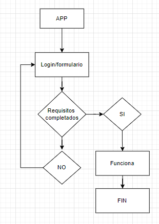
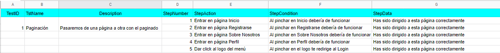

## ANGULAR

> Tarea AVANZADA.

## 🔍 Análisis del problema
Se debe indicar en el directorio específico de la asignatura el problema que se va a resolver de una forma adecuada, es decir, no debe contener ambigüedades, debe ser simple y autocontenido. A continuación veremos lo que será un paginado en el que puedes ir moviéndote entre las páginas.

## 💠Diseño (uml)

Aquí estaría el diseño UML de este formulario

## 🔻Implementación 
Ya está todo el ejercicio implementado como vemos tanto en el apartado de diseño como en el de prueba.

## 🔁Prueba

Aquí tendríamos las pruebas OK tanto de login como de registro   

Aquí tendríamos las pruebas KO tanto de login como de registro   

Y por aquí tenemos una vista general de este boletín mostrando los resultados, de cara al futuro proyecto, con un footer de componente extra y su boceto   

Y por último, aquí tenemos el plan de pruebas:   

