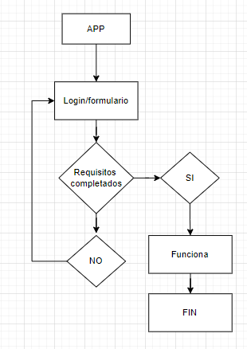
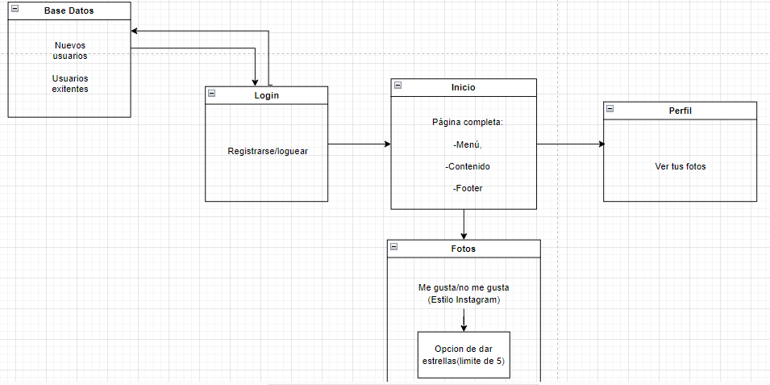
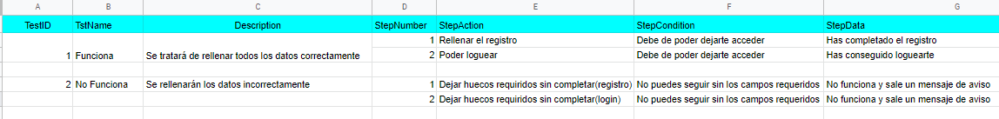

## ANGULAR

> Tarea AVANZADA.

## 🔍 Análisis del problema
Los ejercicios de este boletín van enfocados a la instalación y creación de nuestros primeros componentes:
1. Seguir los pasos de instalación del vídeo suministrado “Instalación Angular.mp4”.
2. Crear los componentes que se indican en la siguiente imagen con la ayuda del vídeo “Componentes Angular.mp4”.
3. Añadir las verificaciones de cada input-botón mostrando un error en caso de que no se cumplan:
- Password: No deben mostrarse los caracteres, sólo los puntos. No debe estar vacío.
- Last Name: Puede estar vacío. Es un input normal.
- First Name: No puede estar vacío. Es un input normal.
- Botón con texto: Puede estar habilitado o deshabilitado.
- Hiperenlace: Mostrará diferentes textos.

4. Añadir un componente que se pueda utilizar para el proyecto individual.
5. Realizar un boceto de cada una de las pantallas que se vayan a utilizar en el proyecto individual con la finalidad de reutilizar este trabajo y así reducir el esfuerzo total.

## 💠Diseño (uml)

Aquí estaría el diseño UML de este formulario

## 🔻Implementación 
Ya está todo el ejercicio implementado como vemos tanto en el apartado de diseño como en el de prueba.

## 🔁Prueba

Aquí tendríamos las pruebas OK tanto de login como de registro   

Aquí tendríamos las pruebas KO tanto de login como de registro   

Y por aquí tenemos una vista general de este boletín mostrando los resultados, de cara al futuro proyecto, con un footer de componente extra y su boceto   

Y por último, aquí tenemos el plan de pruebas:   

