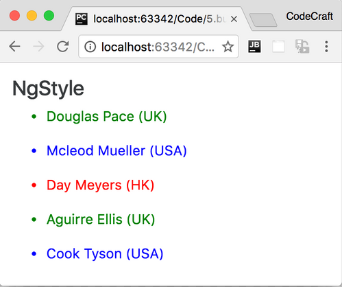
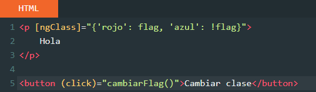
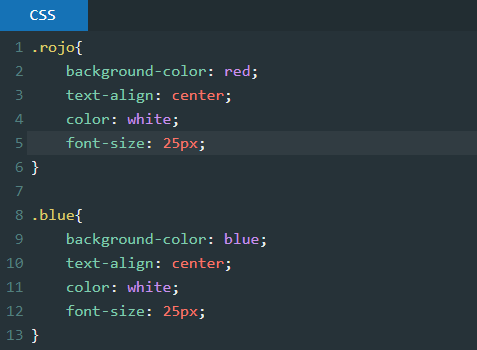
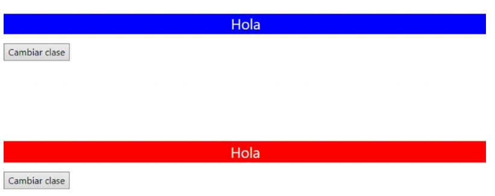

## ANGULAR

> Tarea A3 y A4.
> 
![Logo][1]

[1]: foto/International_Pokémon_logo.svg.png "Creative Commons licensed" 

## 🔍 Análisis del problema
Los ejercicios de este boletín van enfocados al uso de las directivas ngIf y/o ngFor además de la comunicación entre componentes:
1. Aplicar los conceptos dados en la teoría para ampliar las funcionalidades del proyecto utilizando las directivas explicadas y la comunicación entre componentes.
2. Investigar sobre las directivas ngStyle, ngClass y ngTemplate y darle un uso en el proyecto si se viese necesario y mostrar ejemplos en el Readme.md. 

---

- ngStyle: La directiva de atributo ngStyle actualiza los estilos para un elemento HTML determinado. Establece una o más propiedades de estilo, especificadas como pares clave-valor separados por dos puntos. La clave es un nombre de estilo y el valor es una expresión a evaluar o valor a asignar. Si indicamos directamente el valor a asignar tenemos la siguiente sintaxis:

#### <h1 [ngStyle]="{'color':'red','background-color':'#ff0','text-align':'center'}">Sitio fuera de servicio</h1>

---

- ngClass: Cuando hablamos de HTML, una class es un parámetro en una etiqueta que hace referencia a un grupo de estilos que van a determinar la apariencia del elemento. Pero cuando trbajamos en Angular, se hace con las ngClass, que cumplen la misma función pero con más potencia, ya que podemos cambiar el valor de la clase de forma dinámica desde el TS.

 

Este boletín también va enfocado al uso de la recogida de datos mediante servicios, para ello se creará una nueva página que contenga los siguientes elementos:
1. Desplegable con las opciones Fuego (Fire), Agua (Water), Hierba (Grass). Opción de Fuego (Fire) por defecto seleccionado.
2. Un listado de los nombres de los Pokemons del tipo seleccionado en el desplegable arriba mencionado. Los nombres serán hipervínculos que al ser seleccionados nos lleve a la url que viene informado en el servicio.

 

Un listado de los nombres de los Pokemons del tipo seleccionado en el desplegable arriba mencionado. Los nombres serán hipervínculos que al ser seleccionados nos lleve a la url que viene informado en el servicio.

