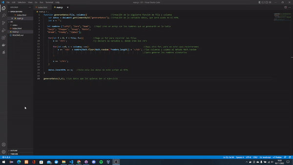
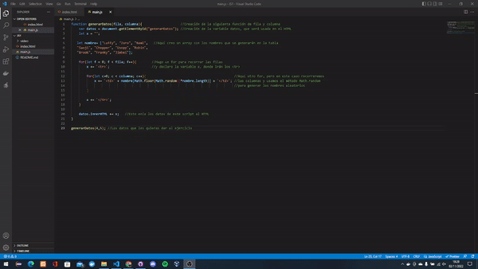
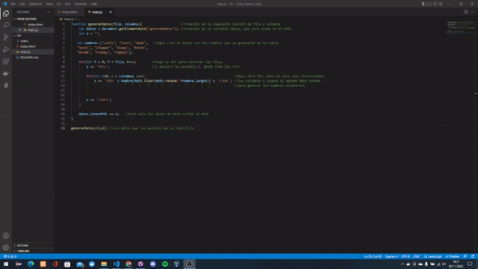

## SCRIPT EN JAVASCRIPT

> Tarea AVANZADA.

## 🔍 Análisis del problema

Se van a generar una tabla con las filas y columnas que pongas dentro del script

#### 🤔¿Qué es un Script y para qué sirve?
- Los scripts son fragmentos de código que tienen como objetivo realizar o añadir funciones dentro de una página web. Cuando hablamos de programación web es un programa o fragmento de código que se encuentra insertado dentro de un documento HTML. Este código es interpretado y ejecutado por el navegador web que utiliza el usuario que accede a ese documento, y no en el servidor donde se alojan los archivos de la página.

 

- Las funciones que se pueden añadir a una página web utilizando scripts son muy amplias. Desde validar formularios web, realizar distintos efectos visuales, modificar el comportamiento del navegador, hasta ventanas emergentes con avisos, o acciones que se ejecutan al pulsar un botón.

## 💠Diseño
#### 👉🏼He estado buscando ejemplos e ideas por internet a la hora de realizar esta actividad

## 🔻Implementación
#### Ya he analizado y realizado el ejercicio con los pasos anteriores, viendose posteriormente en el apartado de pruebas

## 🔁Prueba
---

> Criterio 1:
- Dado que tengo un método generaDatos (5, 4).
- Cuando pongo los valores fila 5 y columna 4.
- Entonces me aparece en el html una tabla con 5 filas y 4 columnas con datos randoms.
---

> Criterio 2:
- Dado que tengo un método generaDatos (4, 5).
- Cuando pongo los valores fila 4 y columna 5.
- Entonces me aparece en el html una tabla con 4 filas y 5 columnas con datos randoms.
---

> Criterio 3:
- Dado que tengo un método generaDatos (12, 8).
- Cuando pongo los valores fila 12 y columna 8.
- Entonces me aparece en el html una tabla con 12 filas y 8 columnas con datos randoms.
---

