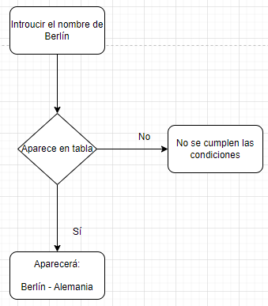
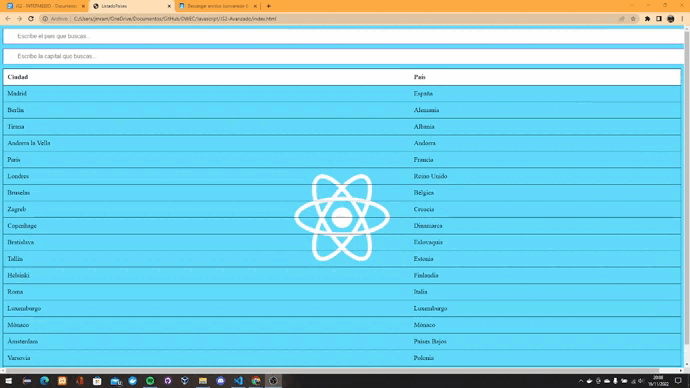
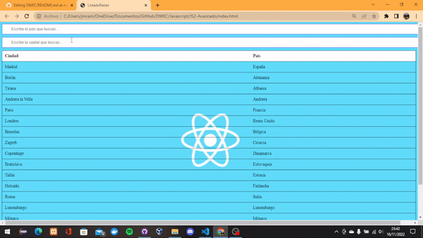
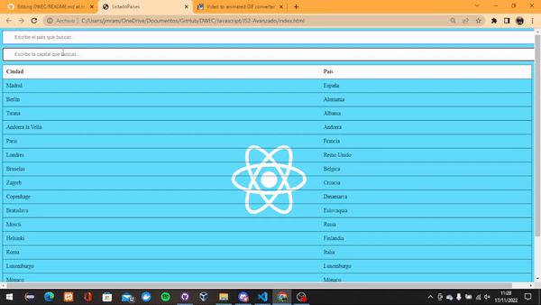
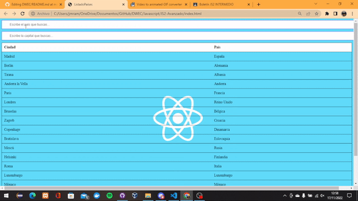
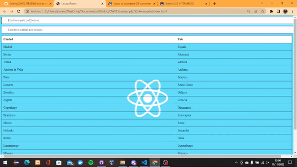
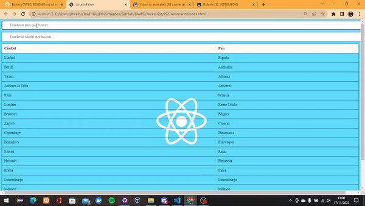

## Generación de JSON de Capitales y Países.

> Tarea AVANZADA.

## 🔍 Análisis del problema
En esta tarea trataremos de realizar 2 buscadores: 1 para la búsqueda de países y otro para capitales. En el que le daremos dichos países y capitaes por un archivo JSON y una tabla hecha por JAVASCRIPT.

#### 🤔 Buscar sobre el tema

## 💠Diseño (uml)

- Aquí vemos un pequeño UML en el que si se cumplen las condiciones se verá el dato reflejado en la tabla, y en caso contrario pues será una prueba incorrecta.

## 🔻Implementación 

Ya está todo el ejercicio implementado como vemos tanto en el apartado de diseño como en el de prueba.

## 🔁Prueba

> ❗❗ Los apartados 1 y 2 van unidos, dado que lo que pide se puede mostrar todo con con un solo gif

### ✏ 1.Generación de json de capitales y países.

  - Como estudiante
  - Quiero visualizar un listado de países con sus capitales
  - Para posteriormente seguir haciendo uso de ellos

 

### 📟2.Modificación y visualización de los cambios en la web.

 

> Historia de usuario:
  - Como estudiante,
  - Quiero visualizar los datos del json en una tabla html,
  - Para obtener un resumen a primera vista.
  
  
  
> Criterio de aceptación:
  - Dado que tenemos un json con los datos previamente indicados,
  - Cuando actualizamos el navegador,
  - Entonces aparecerá una tabla con toda la información suministrada en el json.
  
 
  
  - Dado que tenemos un json con los datos previamente indicados,
  - Cuando añadimos alguna capital/país en el json y actualizamos
  - Entonces aparecerán todas las capitales y países.
  
 
  

 
  ### 🔎3.Filtrado de datos
  
   
  
 > Historia de usuario:
  - Como estudiante,
  - Quiero filtrar las capitales de la tabla previamente indicada,
  - Para obtener una tabla filtrada.
  
   
  
 > Criterio de aceptación:
 
  1. Dado que tenemos una tabla con las capitales y países,
  2. Cuando introducimos en el buscador “Berlín”,
  3. Entonces aparecerá la tabla con esa capital y país únicamente.
  
  
  
  

  
  1. Dado que tenemos una tabla con las capitales y países,
  2. Cuando introducimos en el buscador “cú”,
  3. Entonces aparecerá la tabla con la capital “Moscú” y su país únicamente.
  
  

  

  
  1. Dado que tenemos una tabla con las capitales y países,
  2. Cuando introducimos en el buscador “cu”,
  3. Entonces aparecerá la tabla sin valores.
  
  
  
  

  
  1. Dado que tenemos una tabla con las capitales y países,
  2. Cuando introducimos en el buscador “Alemania”,
  3. Entonces aparecerá la tabla sin valores.
  
  
  
  

  
  
  ### Añadir a la historia de usuario un segundo filtro destinado a filtrar por países además de añadir la descripción de la historia de usuario teniendo como     referencia el arriba indicado.
  
  1. Dado que tenemos una tabla con las capitales y países,
  2. Cuando introducimos en el buscador “andorra”,
  3. Entonces no aparecerá nada en la tabla.

  
  
  

  
  1. Dado que tenemos una tabla con las capitales y países,
  2. Cuando introducimos en el buscador "ña",
  3. Entonces aparecerá España en la tabla junto con su capital.

  
  
  

  
  1. Dado que tenemos una tabla con las capitales y países,
  2. Cuando introducimos en el buscador “Belgica”,
  3. Entonces no aparecerá nada en la tabla.

  
  
  

  
  1. Dado que tenemos una tabla con las capitales y países,
  2. Cuando introducimos en el buscador “al”,
  3. Entonces aparecerán todos los países y capitales que lo contengan.

  
