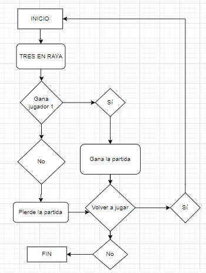
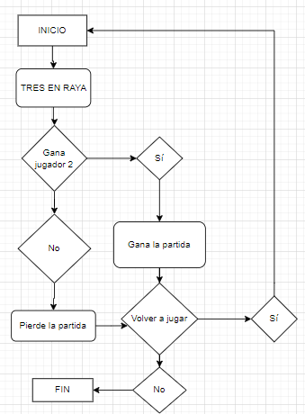
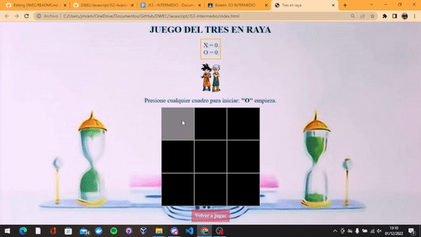
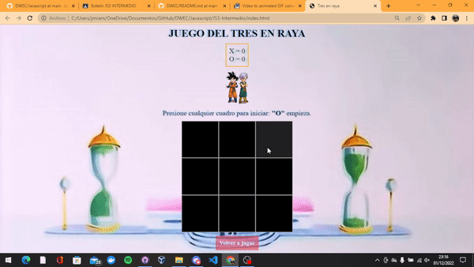
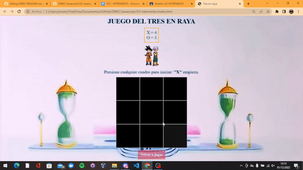
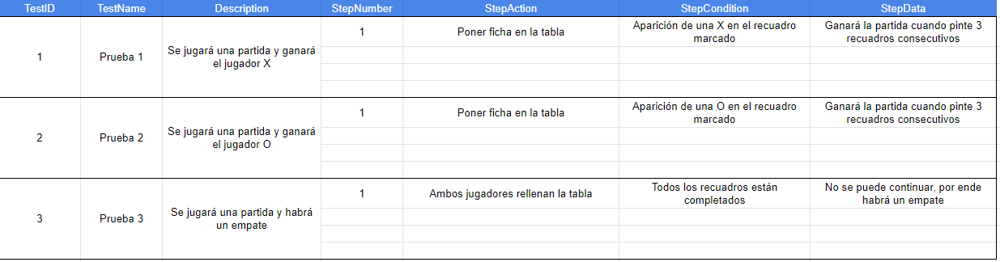

## Generación de un Tres en Raya con Javascript

> Tarea INTERMEDIA.⭕➕❌

## 🔍 Análisis del problema
Se debe realizar un tres en raya con Javascript acorde a las intrucciones del boletín, sea para 2 jugadores y contenga su propio contador. Y sus requisitos:
- Cada jugador solo debe colocar su símbolo una vez por turno.
- No se puede seleccionar la misma casilla más de una vez.
- Se debe conseguir realizar una línea recta o diagonal por símbolo.
> Y el ganador de la partida sumará un punto a su contador y aparecerá un aviso de si se quiere volver a jugar.

## 💠Diseño (uml)

A continuación se muestran los 3 posibles diseños de UML:
> Cuando gana el jugador X.   

---

> Cuando gana el jugador O.   

---

> Cuando se produce un empate.   

## 🔻Implementación 
Ya está todo el ejercicio implementado como vemos tanto en el apartado de diseño como en el de prueba.

## 🔁Prueba

Esta sería la primera prueba de implementación, en la que vemos que el Jugador X gana la partida.   

Esta sería la segunda prueba de implementación, en la que vemos que el Jugador O gana la partida.   

Y esta sería la tercera prueba de implementación, en la que vemos que se produe un empate.   

  
Y por último el plan de pruebas del boletín en un excell

