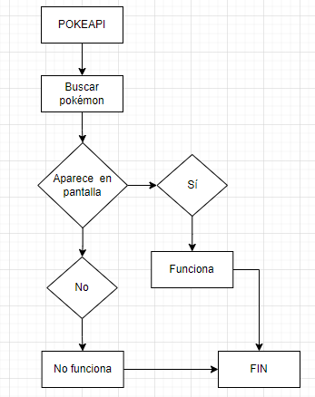
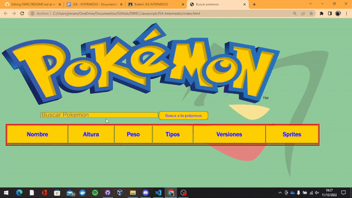
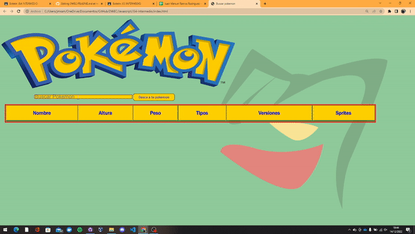
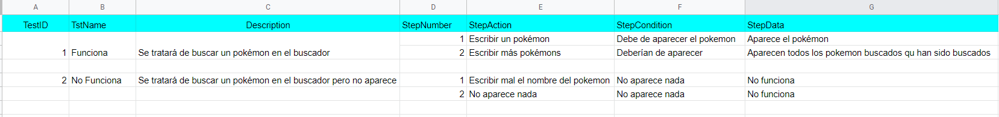

## PokeAPI

> Tarea INTERMEDIA.

![Logo][1]

[1]: International_Pokémon_logo.svg.png "Creative Commons licensed" 

## 🔍 Análisis del problema
Analizar la PokeAPI y comprobar cuales son las peticiones que son necesarias para realizar los posteriores ejercicios.
La aplicación contendrá los siguientes elementos visuales:
- Un campo de texto editable donde al introducir el nombre de un pokemon (sin tener en cuenta si es en mayúsculas o minúsculas), se obtendrá la información del Pokémon que se indica a continuación.
- Sprite del Pokémon buscado.
- Nombre del Pokémon buscado.
- Altura del Pokémon buscado.
- Peso del Pokémon buscado.
- Listado del nombre de las versiones en las que aparece el Pokémon buscado.
- Tipo/s del Pokémon buscado.

Además de esto se ha usado Postman, una aplicación que nos permite realizar pruebas API. Es un cliente HTTP que nos da la posibilidad de testear ‘HTTP requests’ a través de una interfaz gráfica de usuario, por medio de la cual obtendremos diferentes tipos de respuesta que posteriormente deberán ser validados el cual nos ofrece muchos métodos para interactuar con los ‘endpoints’.  Los más utilizados y sus funciones son:
- GET: Obtener información
- POST: Agregar información
- PUT: Reemplazar la información 
- PATCH: Actualizar alguna información
- DELETE: Borrar información

   
 
Al testear APIs con Postman, normalmente obtendremos diferentes códigos de respuesta. Los más comunes incluyen:
- Serie 100 ➡ Respuestas Temporales, por ejemplo: ‘102 Processing’.
- Serie 200 ➡ Respuestas donde el cliente acepta el request, siendo procesado exitosamente en el server, por ejemplo: ‘200 Ok’.
- Serie 300 ➡ Respuestas relacionadas a redireccionamiento URL, por ejemplo: ‘301 Moved Permanently’.
- Serie 400 ➡ Respuestas de error del lado del cliente, por ejemplo: ‘400 Bad Request’.
- Serie 500 ➡ Respuestas de error del lado del server, por ejemplo: ‘500 Internal Server Error’.

## 💠Diseño (uml)

A continuación se muestran los requisitos que deben de cumplirse cuando haces una búsqueda de cualquier pokémon.
  

## 🔻Implementación 
Ya está todo el ejercicio implementado como vemos tanto en el apartado de diseño como en el de prueba.

## 🔁Prueba

Aquí tenemos una primera prueba donde introducimos los nombrs de algunos pokemons y se muestran como podemos ver.   

Y en esta segunda prueba pretendo forzar para que no funciones   

Y aquí tenemos el excel del plan de pruebas de este boletín   

