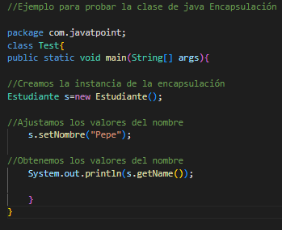
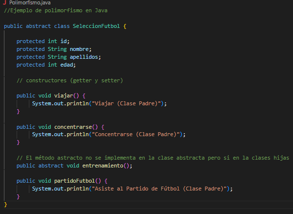
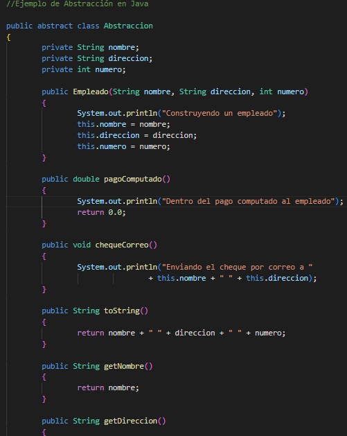
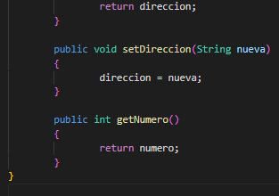
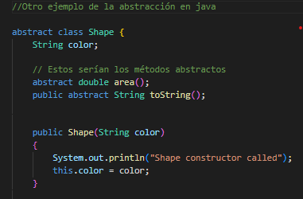
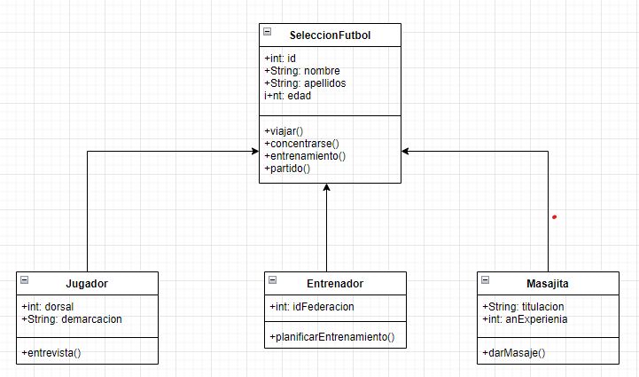
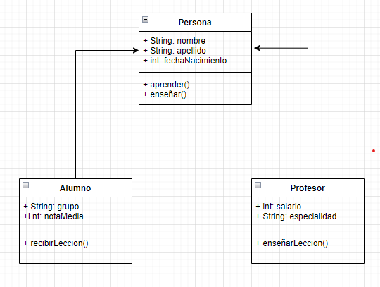

## Programación Orientada a Objetos

> Tarea AVANZADA.

### 🔍 Análisis del problema

Se van a representar las Clases, Objetos e Instancias en Java.

#### 🤔 ¿Qué son?

🎇🎇 **Clases** 🎇🎇

### 👨‍👩‍👦‍👦 **¿Qué es la herencia en Java?**

La herencia es un mecanismo que permite la definición de una clase a partir de la definición de otra ya existente.
Además te permite compartir automáticamente métodos y datos entre clases, subclases y objetos. está fuertemente 
ligada a la reutilización del código en la OOP. Su principal ventaja es la capacidad de utilizar el mismo código
que hemos programado en una clase, en otras clases que heredan de ella sus ***métodos (funciones)*** y sus ***atributos (variables)***. 
Se puede dividir en 2 clases:
1. **Superclase:** puedes tener cualquier número de subclase que quieras.
2. **Subclase:** al contrario que la superclase, aquí solo puedes crear una.

---

### 💊 Encapsulación en Java

La encapsulación en Java es un mecanismo para envolver los datos (variables) y el código que actúa sobre los datos (métodos) 
juntos como una sola unidad. Las variables de una clase se ocultarán de otras clases y solo se puede acceder a ellas a través
de los métodos de su clase actual. Por eso, también se le conoce como ***ocultación de datos.*** 
Para realizar la encapsulación se necesita lo siguiente:
- Declarar las variables de una clase como ***privadas***.
- Proporcionar métodos ***setter*** y ***getter*** para modificar y ver los valores de las variables.

---

### 🕳Abstraction en Java, ¿qué es?

La abstracción consiste en seleccionar datos de un conjunto más grande para mostrar solo los detalles relevantes del objeto. 
Ayuda a reducir la complejidad y el esfuerzo de programación. En Java, la abstracción se logra usando clases e interfaces abstractas. Es uno
de los conceptos más importantes de OOPs.
En un nivel más avanzado, sirve para ocultar los detalles de implementación y mostrar así solo la funcionalidad para el usuario. Solo indica
cosas importantes para el usuario ocultando detalles internos.

---

> ✔ ***Ventajas:*** El principal beneficio de usar una clase abstracta es que te permite agrupar varias clases relacionadas como hermanos. Y ayuda  a reducir 
> la complejidad del diseño y el proceso de implementación del software. 

---

### Y por último, ¿sabes que es el Polimorfismo?🤔🙄

👇

El polimorfismo es la capacidad que tienen los objetos de una clase en ofrecer respuesta distinta e independiente en función de los parámetros (diferentes implementaciones) utilizados durante su invocación. Dicho de otro modo el objeto como entidad puede contener valores de diferentes tipos durante la ejecución del programa.
En el polimorfismo, que se refiere a la idea de _tener muchas formas_, ocurre cuando hay una jerarquía de clases relacionadas entre sí a través de la herencia.
Por lo general existen 3 tipos:
- *Sobrecarga:* es el más conocido y se aplica cuando existen funciones con el mismo nombre en clases que son completamente independientes una de la otra.
- *Paramétrico:* hay funciones con el mismo nombre pero se usan diferentes parámetros, ya pueda ser el nombre o tipo. Se selecciona el método dependiendo del tipo de datos que se envíe.
- *Inclusión:* cuando llamas a un método sin tener que conocer su tipo, sin tomar en cuenta los detalles de las clases especializadas y utilizando una interfaz común.

---

`Pruebas de la resolución del problema`

---

---

---

 

---

---

### 📐 Diseño de la solución

### UML de Polimorfismo

`En este ejemplo de uml vemo reflejado el Polimorfismo`

---
### UML de Herencia 

`Y aquí el UML de lo que sería la herencia`
 

---
